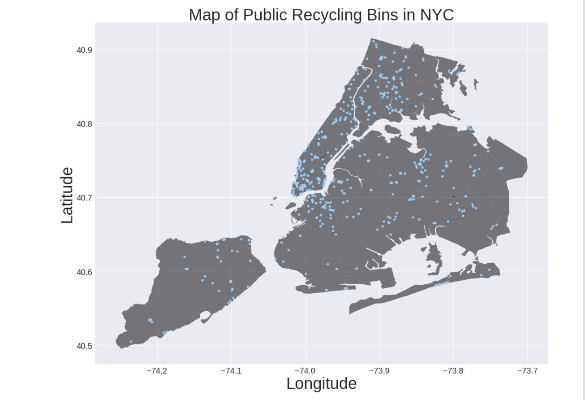

Figure 1: Map showing all of the places public recycling bins are located throughout New York City. Lower Manhattan has a large concentration of public recycling bins, while Statan Islands, and parts of Queens and Brooklyn have very few public recycling bins.

## Review:

#### CLARITY:
* This map is easy to read, with every point represents a location.
* title, label, axis are all clear. Font sizes are large enough.
* As the public recycling bins have two types: __green bins__ for recycling newspapers, magazines, and mixed paper; __blue bins__ for recycling metal, glass bottles and jars, rigid plastic containers, and food and beverage cartons [1]. For people knowing this, the blue color may cause misunderstanding. They might think this map tells locations of blue bins only before carefully read the caption.
* It would be even better if the data source been stated.

#### AESTHETIC:
* The dark color of NYC shapefile serves a good background for blue points on it.
* I saw the highest density in lower Manhattan without distraction.

#### HONESTY:
* This map honestly represents the locations of the public recycling bins.

For further study:
This plot is interesting because we can see those bins are aggregated in some small areas, instead of evenly distributed on the map.
What attributes do these small areas have in common?

### Reference:
[1]What To Put in Public Recycling Bins. Accessed 2017-11-19. Retrieved from: http://www1.nyc.gov/assets/dsny/zerowaste/residents/public-spaces.shtml
