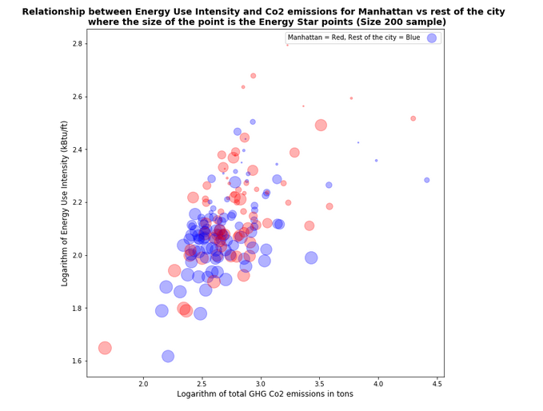

#  Review for jss895
### Reviewed by: ep2247

**Review:**
    The plot is clear and easy to read.  The colors make sense for what is being conveyed in the plot.  When testing for color blindness, you are still able to distinguish all of the colors for each of the three color blind tests that were preformed.  The person did a good job at explaining what the plot was showing in the caption.  One suggestion would be to fix your legend and have Manhattan on one line with a red dot, than have the other boroughs on a seperate line with a blue dot.

# FBB 

I asked to comment explicitly on 

- clarity

- esthetics

- honesty.

Your comments are relating to these topics, but not explicityl addressing to which axis the flaws contribute

things you missed:

**clarity** The legend is too small to read. You partially addres this but it is a problem that it states Manhattan red, rest blue, and plots a single blue data point for the rest of the city. either both should be plotted or neither. this is detracting from clarity.

the point size is a further dimension plotted but it is not explained what different point sizes mean

The labels are too small everywhere.

**esthetics**: the low resolution is both distracting and unappealing

8/10
